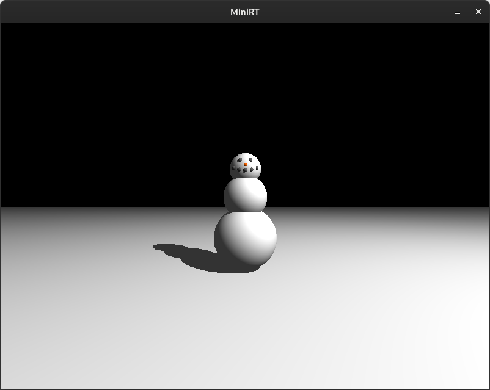
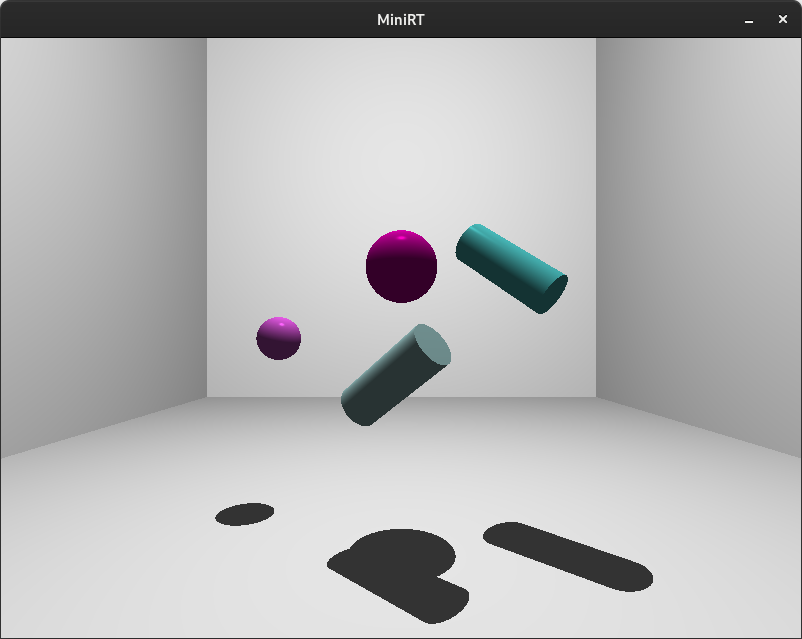
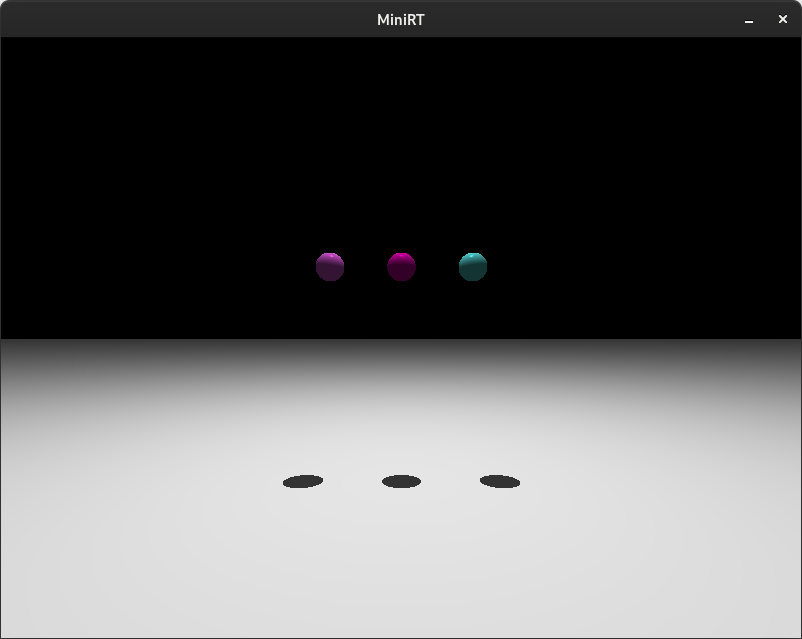

# MiniRT: Mini Ray Tracer in C

This project has been created as part of the 42 curriculum by **caburges** and **alsuchon**.

## Description

The MiniRT project is a ray tracer implementation exercise in the 42 curriculum that introduces students to computer graphics, 3D rendering, and mathematical foundations of ray tracing. The project involves creating a program that generates photorealistic images by simulating the physical behavior of light rays as they interact with 3D objects.

The challenge is to implement ray-object intersection algorithms, handle light sources, compute shadows, and manage a scene described in a custom file format. This project serves as an introduction to computer graphics fundamentals including vector mathematics, geometric transformations, color theory, and the MiniLibX graphics library.

## Key Features

- Ray tracing engine with camera positioning and orientation
- Support for multiple geometric objects:
  - Spheres with adjustable radius
  - Planes with normal vectors
  - Cylinders with height and diameter
- Ambient, diffuse, and specular lighting
- Shadow computation for realistic lighting
- Scene parsing from .rt configuration files
- Real-time rendering with MiniLibX
- Camera field of view control
- RGB color support for objects and lights
- Keyboard controls for interactive navigation
- Fully compliant with 42's norminette coding standards

## Visual Examples

### Scene Renders








## Instructions

### Prerequisites

- C compiler (cc)
- Make
- Linux operating system

### Installation

Clone the repository:

```bash
git clone https://github.com/caburges/minirt.git
cd minirt
```

### Compilation

To compile the project, run:

```bash
make
```

This will:
1. Compile the libft library
2. Compile the MiniLibX library
3. Generate a `miniRT` executable

### Usage

Run the program with a scene file:

```bash
./miniRT scene/scene1.rt
```

#### Scene File Format

Scene files (.rt) define the 3D world using the following elements:

**Ambient Lighting:**
```
A 0.2 255,255,255
```
Format: `A [ratio] [R,G,B]`
- ratio: ambient lighting intensity (0.0 to 1.0)
- R,G,B: color values (0-255)

**Camera:**
```
C 0,0,-10 0,0,1 70
```
Format: `C [x,y,z] [nx,ny,nz] [fov]`
- x,y,z: camera position
- nx,ny,nz: orientation vector (normalized)
- fov: field of view in degrees (0-180)

**Light:**
```
L -5,5,-15 0.8 255,255,255
```
Format: `L [x,y,z] [brightness] [R,G,B]`
- x,y,z: light position
- brightness: light intensity (0.0 to 1.0)
- R,G,B: color values (0-255)

**Sphere:**
```
sp 0,0,5 4.0 255,0,0
```
Format: `sp [x,y,z] [diameter] [R,G,B]`
- x,y,z: sphere center position
- diameter: sphere diameter
- R,G,B: color values (0-255)

**Plane:**
```
pl 0,0,0 0,1,0 200,200,200
```
Format: `pl [x,y,z] [nx,ny,nz] [R,G,B]`
- x,y,z: point on the plane
- nx,ny,nz: normal vector (normalized)
- R,G,B: color values (0-255)

**Cylinder:**
```
cy 0,0,0 0,1,0 2.0 5.0 0,255,0
```
Format: `cy [x,y,z] [nx,ny,nz] [diameter] [height] [R,G,B]`
- x,y,z: cylinder center position
- nx,ny,nz: axis orientation (normalized)
- diameter: cylinder diameter
- height: cylinder height
- R,G,B: color values (0-255)

#### Example Scenes

The project includes several example scenes in the `scene/` directory:

```bash
./miniRT scene/sphere_shadow.rt    # Demonstrates shadow rendering
./miniRT scene/cylinder_rainbow.rt # Multiple colored cylinders
./miniRT scene/snowman.rt          # Complex multi-object scene
./miniRT scene/temple.rt           # Architectural scene
./miniRT scene/room_walls.rt       # Indoor scene with walls
```

### Controls

- **Mode selection**: `v` view/camera, `l` light, `s` spheres, `c` cylinders, `p` planes (choose what the transforms affect)
- **Translate (mode target)**: `z` back, `x` forward, `g` right, `d` left, `r` up, `f` down
- **Rotate (camera or oriented objects)**: arrow keys (left/right around Y, up/down around X)
- **Scale radius (sphere/cylinder)**: numpad `+` to grow, numpad `-` to shrink
- **Scale height (cylinder only)**: numpad `PageUp` to lengthen, numpad `PageDown` to shorten
- **Exit**: `ESC` or window close button

### Available Make Rules

- `make` or `make all` - Compiles the project
- `make clean` - Removes object files
- `make fclean` - Removes object files and executables
- `make re` - Recompiles the entire project
- `make norm` - Checks norminette compliance (if implemented)

## Technical Details

### Ray Tracing Algorithm

The ray tracer uses the following pipeline:

1. **Scene Parsing**: Read and validate the .rt configuration file
2. **Camera Setup**: Configure camera position, orientation, and field of view
3. **Ray Generation**: For each pixel, generate a ray from the camera through the viewport
4. **Intersection Testing**: Test the ray against all objects in the scene
5. **Shading Calculation**: For the closest intersection:
   - Calculate surface normal
   - Compute ambient lighting contribution
   - Cast shadow rays to each light source
   - Calculate diffuse and specular components (Phong reflection model)
6. **Color Accumulation**: Combine all lighting contributions
7. **Pixel Rendering**: Set the pixel color in the image buffer

### Mathematical Foundations

#### Vector Operations
- Dot product for angle calculations and projections
- Cross product for perpendicular vectors
- Vector normalization for direction vectors
- Vector addition/subtraction for position calculations

#### Ray-Object Intersections

**Sphere**: Solved using quadratic equation
```
t² + 2bt + c = 0
where ray = origin + t * direction
```

**Plane**: Solved using dot product
```
t = (plane_point - ray_origin) · plane_normal / (ray_direction · plane_normal)
```

**Cylinder**: Combination of quadratic equation (body) and plane intersection (caps)

### Shadow Computation

For each light source, a shadow ray is cast from the intersection point toward the light. If any object intersects this ray, the point is in shadow and only ambient lighting is applied.

### Color Management

Colors are represented as RGB tuples with values from 0-255. Color operations include:
- Addition and subtraction for light accumulation
- Scalar multiplication for intensity
- Component-wise multiplication for color filtering
- Clamping to ensure values stay within valid range
